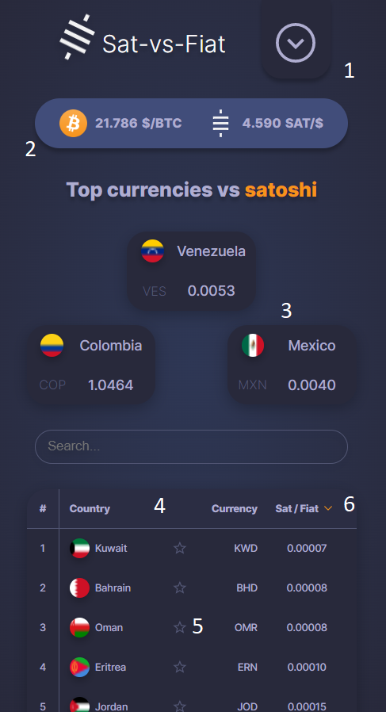
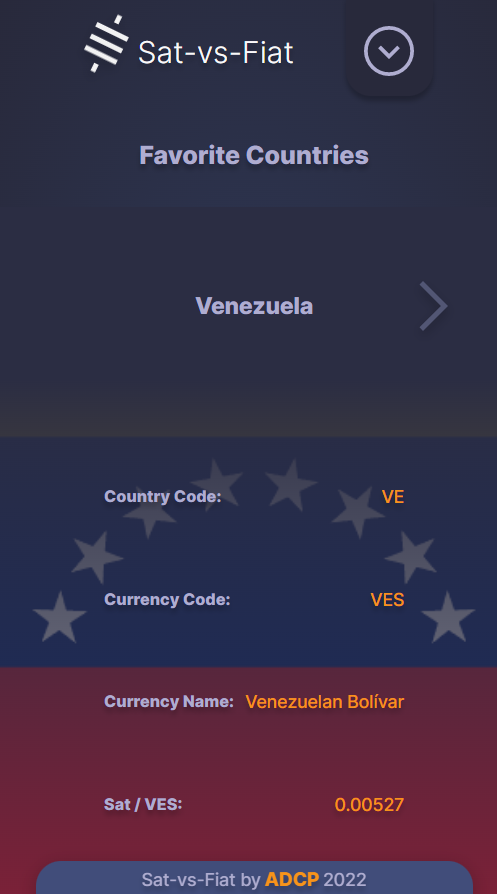
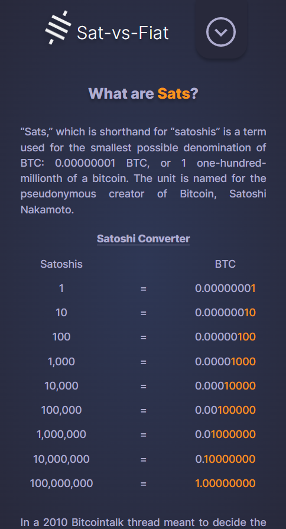
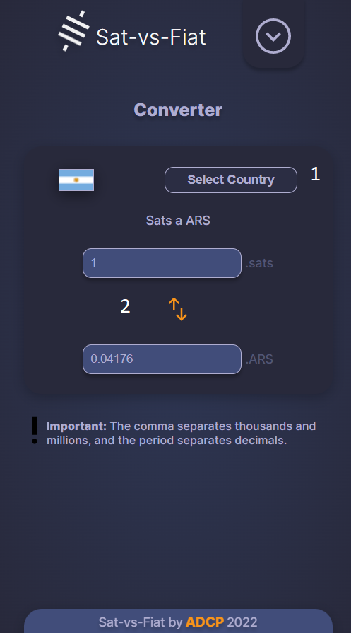

# Sat vs Fiat!

Ranking of currency exchange rates of different countries with respect to satoshi.

## Index

- [Problem to solve](#problem-to-solve)
- [Technologies used](#technologies-used)
- [Requirements](#requirements)
- [Functionality](#functionality)
  - [Ranking view](#ranking-view)
  - [Favorites countries](#favorites-countries)
  - [Satoshi Info](#satoshi-info)
  - [Converter](#converter)

## Problem to solve

I have not been able to find a page that will show me a ranking of sat/fiat exchange rates of countries in the world.

## Technologies used

  <table>
    <tr>
      <td></td>
      <td>Semantic labels, Meta tags</td>
    </tr>
    <tr>
      <td></td>
      <td>FlexBox, Grid CSS, Custom properties</td>
    </tr>
    <tr>
      <td></td>
      <td>SPA, AJAX, DOM manipulation, modules, localStorage</td>
    </tr>
  </table>

## Requirements

Smartphone or computer with a web browser installed and internet.

## Functionality

### Ranking view

<!-- https://alejoprin.github.io/No_te_pases_ma/assets/ReadmeInstall.png -->

  

1. Options button.
1. Bitcoin and satoshis exchange rate against the dollar.
1. Top 3 currencies (arbitrarily selected).
1. Ranking.
1. Button to sort countries depending on exchange rate.
1. Button to add to favorites.

 

### Favorites Countries

  

List of favorite countries, where it shows; the country code, currency code, currency name, and the exchange rate against the Satoshi.

 

### Satoshi Info

  

Brief explanation of where the word satoshi comes from, and how to read it.

 

### Converter

  

1. Button to select the country to perform the calculation.
1. Button to indicate the type of calculation: sat/fiat or fiat/sat.
